<table style="width:100%">
  <tr>
    <th width="100%" colspan=6><h2>XUP SDx Labs (2018.3)</h2></th>
  </tr>
  <tr>
    <td align="center"><a href="setup_sdx.md">1. Setup SDx</a></td>
    <td align="center"><a href="sdx_introduction.md">2. Introduction to SDx</a></td>
    <td align="center"><a href="Optimization_lab.md">3. Optimization</a></td>
    <td align="center"><a href="rtl_kernel_wizard_lab.md">4. RTL Kernel Wizard</a></td>
    <td align="center"><a href="debug_lab.md">5. Debugging</a></td>
    <td align="center"><a href="sources/helloworld_ocl/command_line.ipynb">6. SDx command line</a></td>
  </tr>
</table>

# Optimization Lab

## Introduction

In this lab you will create an SDx project and analyze the design to optimize the host code and kernel code to improve the performance of the design.

## Objectives

After completing this lab, you will be able to:

- Analyze the design and read project reports
- Optimize the kernel code to improve throughput
- Optimize the host code to improve the data transfer rate
- Verify the functionality of the design in hardware

### Create an SDx Project

* Start SDx and select the default workspace (or continue with the workspace from the previous lab)

* Click on the **Create Application Project** 

* In the _New Project_&#39;s page enter **optimization\_lab** in the _Project name:_ field and click **Next**

* Select your target platform and click **Next**

* Select **Empty Application** and click **Finish**

### Import the source files into the project

* In the _Project Explorer_ expand the *optimization_lab* folder if necessary, and right-click on the **src** folder and select **Import…**

* Select **General &gt; File System**, click **Next**, browse to the source directory at **~/compute_acceleration/sources/optimization\_lab** and click **OK**

* Select the **idct.cpp** and **krnl\_idct.cpp** files and click **Finish**

* Expand the **src** folder in the _Project Explorer_ and note the two added files

### Add a function as a hardware kernel

* Click on the _Add Hardware Function_ button icon () in the **Hardware Functions** tab to see functions available for implementation in hardware.

* Select _krnl\_idct_ function and click **OK**

    

* Notice a **binary\_container\_1** folder is created automatically under which the _kml\_idct_ function is added

### Analyze the source files

* From the *Project Explorer* open the **src>krnl\_idct.cpp** file

* The **Outline** panel should be visible. It displays an outline of the code of the source file that is currently in scope. If you can't see it, go to **Window > Show View > Outline**. 

    The outline view can be used to navigate the source file. For example, function names are displayed in the outline view, and clicking on a function will jump to the line of code where the function is defined. 

    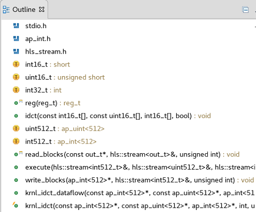

* In the _Outline_ viewer, click **idct** to look up the function

The `idct()` function is the core algorithm in the kernel. It is a computationally intensive function that can be highly parallelized on the FPGA, providing significant acceleration over a CPU-based implementation.

* Review the code

    - **krnl\_idct** : Top-level function for the hardware kernel. Interface properties for the kernel are specified in this function
    - **krnl\_idct\_dataflow** : Called by the **krnl\_idct** function and encapsulates the main functions of the kernel
    - **read\_blocks** : Reads data from global memory data sent by the host application and streams to the *execute* function
    - **execute** : For each 8x8 block received, calls the **idct** function to perform the actual IDCT computation 
    - **write\_blocks** : Receives results from the **execute** function and writes them back to global memory for the host application  
    
* Open the **idct.cpp** file.  Again, use the _Outline_ viewer to quickly look up and inspect the important functions of the host application:  
    - **main** : Initializes the test vectors, sets-up OpenCL resources, runs the reference model, runs the hardware kernel, releases the OpenCL resources, and compares the results of the reference IDCT model with the hardware implementation
    - **runFPGA** : Takes in a vector of inputs and for each 8x8 block calls the hardware accelerated IDCT using the **write** , **run** , **read** , and **finish** helper functions. These function use OpenCL API calls to communicate with the FPGA
    - **runCPU** : Takes in a vector of inputs and, for each 8x8 block, calls **idctSoft** , a reference implementation of the IDCT
    - **idctSoft** : Software implementation of the IDCT algorithm, used to check the results from the FPGA
    - **oclDct** : This class is used to encapsulate the OpenCL runtime calls to interact with the kernel in the FPGA
    - **aligned\_allocator** , **smalloc** , **load\_file\_to\_memory** : These are small helper functions used during test vector generation and OpenCL setup  
* Look at the code around line number 580 of the **idct.cpp** file by pressing Ctrl+l (small L) and entering 496. 
  This section of code is where the OpenCL environment is setup in the host application. It is typical of most SDx application and will look very familiar to developers with prior OpenCL experience. This body of code can often be reused as-is from project to project.  

To setup the OpenCL environment, the following API calls are made: 

   - **clGetPlatformIDs** : Queries the system to identify any available OpenCL platforms. It is called twice as it first checks the number of available platforms before extracting the list of platforms
   - **clGetPlatformInfo** : Get information about the OpenCL platform, such as vendor name and platform name
   - **clGetDeviceIDs** : Obtain a list of devices available on a platform
   - **clCreateContext** : Creates an OpenCL context, which manages the runtime objects
   - **clGetDeviceInfo** : Get information about an OpenCL device like the device name
   - **clCreateProgramWithBinary** : Creates a program object for a context, and loads specified binary data into the program object. The actual program is obtained before this call through the `load_file_to_memory()` function
   - **clCreateKernel** : Creates a kernel object
   - **clCreateCommandQueue** : Create a command-queue on a specific device

Note: all objects accessed through a **clCreate...** function call should be released before terminating the program by calling a corresponding **clRelease...**  This avoids memory leakage and clears the locks on the device

### Configure the System Port options

#### Configure the System Port in the SDx GUI

In the *idct.cpp* file, locate lines 286-297. Note that two memory buffers, *mInBuffer* and *mOutBuffer* are being used. The memory buffers will be located in external DRAM. The kernel will have one or more ports connected to the memory bank(s). By default, the compiler will connect all ports to BANK0 or DDR[0]. For Alveo, memory interfaces can be configured from the SDx GUI, or via a "System Port" switch (--sp) that is passed to the XOCC Kernel Linker. For AWS only the "System Port" switches are currently supported. 

* For Alveo, in the *Assistant view, right click on Emulation-HW and click **Settings***
* In the *Hardware Function Settings* expand *optimization_lab > Emulation-SW > binary_container_1* and select **krnl_idct**

* Under *Compute Unit Settings* expand *krnl_idct* and krnl_idct_1

* From the dropdown block under *Memory* select the following:

   * block: DDR[0] 
   * q: DDR[0]
   * voutp: DDR[1]

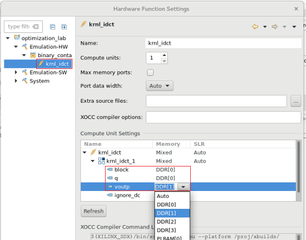

Click **Apply and Close**

#### Configure the System Port command line switch

For AWS, you can set memory interfaces by passing the --sp compiler switch to the XOCC kernel linker: 

```
    --sp <kernel_instance_name>.<interface_name>:<bank name> 
```

Where:

* **<kernel_instance_name>** is the instance name of the kernel 
* **<interface_name>** is the name of the memory interface 

The interface names can be found in the **Emulation-SW (or Emulation-HW) > binary_container_1 > reports > link >binary_container_1.xclbin.info** log file

* In this case the linker switches would be 

```console
   --sp krnl_idct_1.m_axi_gmem0:bank0 
   --sp krnl_idct_1.m_axi_gmem1:bank0 
   --sp krnl_idct_1.m_axi_gmem2:bank1
```

* In the Project Explorer pane, right-click the project **optimization_lab_example** and select the **C/C++ Settings**

* Select **C/C++ Build** > **Settings** in the left pane
* Select the **Miscellaneous** under **SDx XOCC Kernel Linker**


The switches can be added individually, or all on one line. 

### Build and run software emulation (Emulation-SW)

* Make sure the **project.sdx** under _Optimization\_lab_ in the **Project Explorer** tab is selected
* Select **Emulation-SW** as the *Active Build Configuration*
* Build the project () button  
* In the Project Explorer pane, right-click the project **optimization\_lab** and select **Run As** &gt; **Run Configurations…**
* Select the **Arguments** tab
* Click on the **Automatically add binary container(s) to arguments** check box  
This will add **../binary\_container\_1.xclbin**
* Click **Apply** and then click **Run**  
     The application will be run and the output will be displayed in the Console tab

```console
[Console output redirected to file:/home/cmccabe/workspace/optimization_lab/Emulation-SW/optimization_lab-Default.launch.log]
FPGA number of 64*int16_t blocks per transfer: 256
DEVICE: xilinx_u200_xdma_201830_1
Loading Bitstream: ../binary_container_1.xclbin
INFO: Loaded file
Create Kernel: krnl_idct
Create Compute Unit
Setup complete
Running CPU version
Running FPGA version
Runs complete validating results
TEST PASSED
RUN COMPLETE
```

### Review the software emulation reports
* In the **Assistant** tab, expand **optimization\_lab** &gt; **Emulation-SW** &gt; **optimization\_lab-Default** 

  There will be two files generated by the tool after running the software emulation: Profile Summary and Application Timeline


* Double-click the **Profile Summary** report and review it  

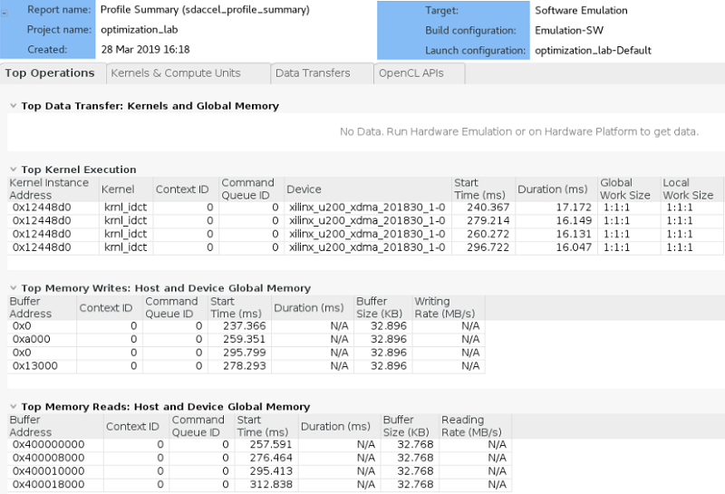

* Click on each of tabs and review the report:  
    - **Top Operations** : Shows all the major top operations of memory transfer between the host and kernel to global memory, and kernel execution. This allows you to identify throughput bottlenecks when transferring data. Efficient transfer of data to the kernel/host allows for faster execution times
    - **Kernels &amp; Compute Units** : Shows the number of times the kernel was executed. Includes the total, minimum, average, and maximum run times. If the design has multiple compute units, it will show each compute unit&#39;s utilization. When accelerating an algorithm, the faster the kernel executes, the higher the throughput which can be achieved. It is best to optimize the kernel to be as fast as it can be with the data it requires
    - **Data Transfers** : This tab has no bearing in software emulation as no actual data transfers are emulated across the host to the platform. In hardware emulation, this shows the throughput and bandwidth of the read/writes to the global memory that the host and kernel share
    - **OpenCL APIs** : Shows all the OpenCL API command executions, how many time each was executed, and how long they take to execute

* Double-click the **Application Timeline** report and review it

    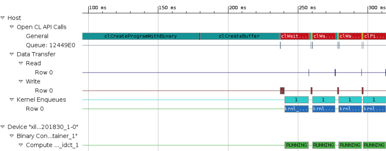

The **Application Timeline** collects and displays host and device events on a common timeline to help you understand and visualize the overall health and performance of your systems. These events include OpenCL API calls from the host code: when they happen and how long each of them takes.

### Perform HW Emulation      
* Click on the drop-down button of _Active build configuration_ and select **Emulation-HW**

* Assign the System Ports as you did in the Emulation-SW mode

   * In the *Assistant view* > right click on *Emulation-HW* and click **Settings**

   * Expand *optimization_lab > Emulation-HW > binary_container_1* and select **krnl_idct**
   * Under *Compute Unit Settings* expand *krnl_idct* and krnl_idct_1
   * Select the following:

       - mInBuffer: DDR[0] 
       - mOutBuffer: DDR[1]
   
* Build the project () 

* Select **Run &gt; Run Configurations…** to open the configurations window

* In the *Main* tab, click to select **Use waveform for kernel debugging** and **Launch live waveform** 

    

* Click on the **Arguments** tab and make sure the _binary\_container\_1.xclbin_ is already assigned  

  If no argument was assigned click to select **Automatically add binary container(s) to arguments**, and click **Apply**

* Click **Run** to run the application  

The Console tab shows that the test was completed successfully along with the data transfer rate  

```
[Console output redirected to file:/home/nimbix/workspace/optimization_lab/Emulation-HW/optimization_lab-Default.launch.log]
FPGA number of 64*int16_t blocks per transfer: 256
DEVICE: xilinx_u200_xdma_201830_1
Loading Bitstream: ../binary_container_1.xclbin
INFO: Loaded file
INFO: [SDx-EM 01] Hardware emulation runs simulation underneath. Using a large data set will result in long simulation times. It is recommended that a small dataset is used for faster execution. This flow does not use cycle accurate models and hence the performance data generated is approximate.
Create Kernel: krnl_idct
Create Compute Unit
Setup complete
Running CPU version
Running FPGA version
Runs complete validating results
TEST PASSED
RUN COMPLETE
INFO: [SDx-EM 22] [Wall clock time: 14:53, Emulation time: 0.075225 ms] Data transfer between kernel(s) and global memory(s)
krnl_idct_1:m_axi_gmem-DDR[0]          RD = 128.000 KB             WR = 0.000 KB        
krnl_idct_1:m_axi_gmem1-DDR[0]          RD = 0.500 KB               WR = 0.000 KB        
krnl_idct_1:m_axi_gmem2-DDR[1]          RD = 0.000 KB               WR = 128.000 KB

INFO: [SDx-EM 06-0] Waiting for the simulator process to exit
```

Notice that Vivado was started and the simulation waveform window is updated.

* Click on the Zoom full button and scroll down the waveform window to see activities taking place in the kernel  

Notice that the execution is sequential


You can close Vivado when you are ready. We will not examine the transactions in detail. 

### Understand the HLS Report, profile summary, and Application Timeline

* In the **Assistant** tab, expand **optimization\_lab** &gt; **Emulation-HW** &gt; **optimization\_lab-Default**

* Double-click the **Profile Summary** report and review it

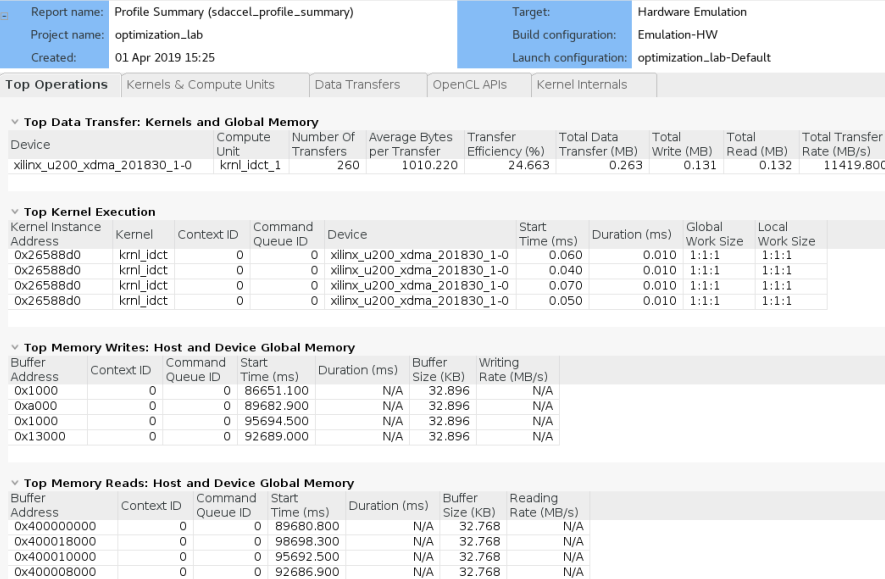

* Click on the **Kernels &amp; Compute Units** tab of the Profile Summary report

* Review the Kernel **Total Time (ms)**  

  This number will serve as a baseline (reference point) to compare against after optimization.

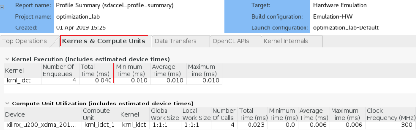

* In the **Assistant** tab, expand **optimization\_lab** &gt; **Emulation-HW** &gt; **binary\_container\_1** &gt; **krnl\_idct**

* Double-click the **HLS Report** and review it

    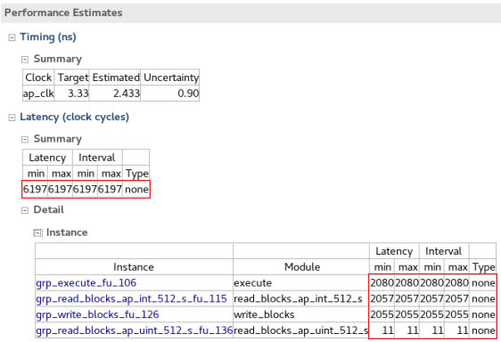

* In the **Performance Estimates** section, expand the **Latency (clock cycles)** &gt; **Summary** and note the following numbers:  

    - Latency (min/max): ~6000
    - Interval (min/max): ~6000

The numbers may vary slightly depending on the target hardware you selected. 
The numbers will serve as a baseline for comparison against optimized versions of the kernel

* In the HLS report, expand **Latency (clock cycles)** &gt; **Detail** &gt; **Instance**

    - Note that the 3 sub-functions read, execute and write have roughly the same latency and that their sum total is equivalent to the total Interval reported in the Summary table
    - This indicates that the three sub-functions are executing sequentially, hinting to an optimization opportunity

    * Close all the reports

### Analyze the kernel code and apply the DATAFLOW directive

* Open the **src > krnl\_idct.cpp** file

* Using the **Outline** viewer, navigate to the **krnl\_idct\_dataflow** function  
  Observe that the three functions are communicating using **hls::streams** objects. These objects model a FIFO-based communication scheme. This is the recommended coding style which should be used whenever possible to exhibit streaming behavior and allow **DATAFLOW** optimization

* Enable the DATAFLOW optimization by uncommenting the **#pragma HLS DATAFLOW** present in the krnl\_idct\_dataflow function (line 319).

The DATAFLOW optimization allows each of the subsequent functions to execute as independent processes. This results in overlapping and pipelined execution of the read, execute and write functions instead of sequential execution. The FIFO channels between the different processes do not need to buffer the complete dataset anymore but can directly stream the data to the next block.

* Comment the three **#pragma HLS stream** statements on lines 324, 325 and 326

* Save the file

### Build the project in Hardware emulation configuration and analyze the HLS report

* Make sure the active configuration is **Emulation-HW**
* Click on the Build button () to build the project
* In the **Assistant** tab, expand **optimization\_lab** &gt; **Emulation-HW** &gt; **binary\_container\_1**  &gt;   **krnl\_idct**
* Double-click the **HLS Report** and review it

()[./images/optimization_lab/FigOptimizationLab-19.png]

* In the **Performance Estimates** section, expand the **Latency (clock cycles)** &gt; **Summary** and note the following numbers:
    - Latency (min/max): ~2000
    - Interval (min/max): ~2000

###  Run the Hardware Emulation

* Run the application by clicking the Run button ()  and wait for the run to finish with RUN COMPLETE message 
  Notice the affect of the dataflow optimization in the VIvado simulation waveform view. Execution of reading, writing, pipelining and kernel is not concurrent.

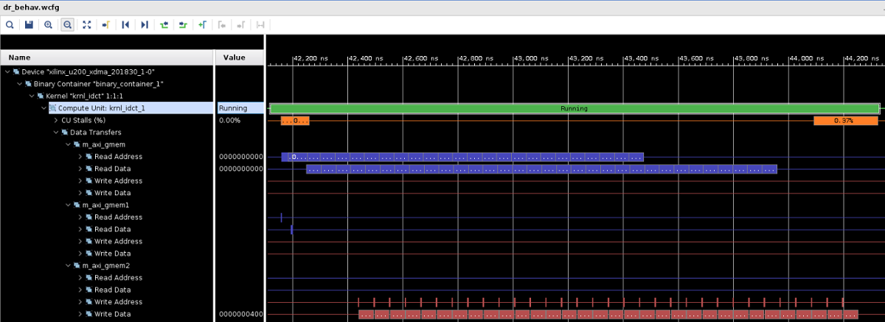

* In the **Assistant** tab, expand **optimization\_lab > Emulation-HW > optimization\_lab-Default**  and double-click the **Profile Summary** report

* Select the **Kernels &amp; Compute Units** tab.  
  Compare the **Kernel Total Time (ms)** with the results from the un-optimized run (numbers may vary slightly to the results displayed below)

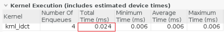

### Analyze the host code

* Open the **src > idct.cpp** file

* Using the **Outline** viewer, navigate to the **runFPGA** function  

  For each block of 8x8 values, the **runFPGA** function writes data to the FPGA, runs the kernel, and reads results back. Communication with the FPGA is handled by the OpenCL API calls made within the `cu.write()`, `cu.run()` and `cu.read()` function calls

    - `clEnqueueMigrateMemObjects()` schedules the transfer of data to or from the FPGA
    - `clEnqueueTask()` schedules the executing of the kernel 
  These OpenCL functions use events to signal their completion and synchronize execution  

* Open the **Application Timeline** of the _Emulation-HW_ run 
  The green segments at the bottom indicate when the IDCT kernel is running
    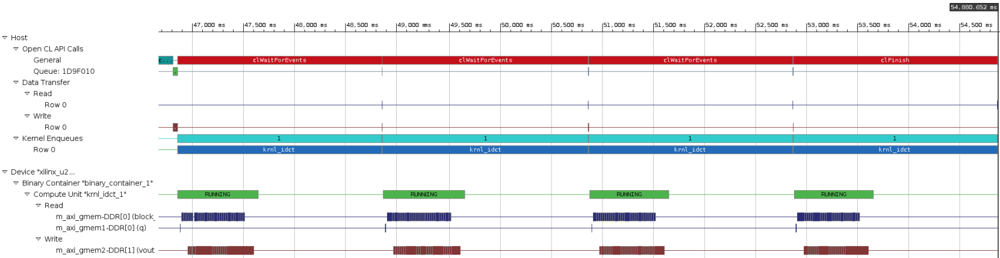

* Notice that there are gaps between each of the green segments indicating that the operations are not overlapping

* Zoom in by performing a left mouse drag across one of these gaps to get a more detailed view  
    - The two green segments correspond to two consecutive invocations of the IDCT kernel
    - The gap between the two segments is indicative of the kernel idle time between these two invocations
    - The **Data Transfer** section of the timeline shows that **Read** and **Write** operations are happening when the kernel is idle
    - The Read operation is to retrieve the results from the execution which just finished and the Write operation is to send inputs for the next execution
    - This represents a sequential execution flow of each iteration

* Close the **Application Timeline**  

* In the **idct.cpp** file, go to the `oclDct::write()` function (line ~260)
    - Notice on line ~274, the function synchronizes on the **outEvVec** event through a call to `clWaitForEvents()`

    ```
        clWaitForEvents(1, &outEvVec[mCount]);
    ```

    - This event is generated by the completion of the `clEnqueueMigrateMemObjects()` call in the `oclDct::read()` function (line ~360)
    - Effectively the next execution of the `oclDct::write()` function is gated by the completion of the previous `oclDct::read()` function, resulting in the sequential behavior observed in the **Application Timeline**

* Use the **Outline** viewer to locate the definition of the **NUM\_SCHED** macro in the **idct.cpp** file
    - This macro defines the depth of the event queue
    - The value of 1 explains the observed behavior: new tasks (write, run, read) are only enqueued when the previous has completed effectively synchronizing each loop iteration
    - By increasing the value of the **NUM\_SCHED** macro, we increase the depth of the event queue and enable more blocks to be enqueued for processing, which may result in the write, run and read tasks to overlap and allow the kernel to execute continuously or at least more frequently
    - This technique is called software pipelining

* Modify line 152 to increase the value of **NUM\_SCHED** to 6 as follows  

```
    #define NUM_SCHED 6
```

* Save the file

### Run Hardware Emulation

* Change the run configuration by unchecking the **Use waveform for kernel debugging** option, click **Apply**, and then click **Close**

* Run the application by clicking the Run button ()  
    - Since only the idct.cpp file was changed, the incremental makefile rebuilds only the host code before running emulation
    - This should be much faster than also recompiling the kernel to hardware 
* In the **Assistant** tab, expand **optimization\_lab > Emulation-HW > optimization\_lab-Default**
* Double-click the **Application Timeline** report  

Observe how **software pipelining** enables overlapping of data transfers and kernel execution.
​
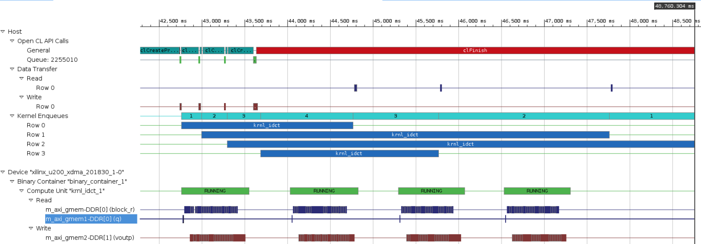

Note: system tasks might slow down communication between the application and the hardware simulation, impacting on the performance results. The effect of software pipelining is considerably higher when running on the actual hardware.

###  Run the Application in hardware

As before, building the FPGA hardware takes some time, and a precompiled solution is provided. 

For AWS, execute the following in a new terminal, as this needs to be run as sudo

```
sudo sh
source /opt/Xilinx/SDx/2018.3.op2405991/settings64.sh
source /opt/xilinx/xrt/setup.sh
export PLATFORM_REPO_PATHS=/home/centos/src/project_data/aws-fpga/SDAccel/aws_platform/xilinx_aws-vu9p-f1-04261818_dynamic_5_0
```

- Start SDx (execute ```sdx``` from the terminal) and from the SDx file menu, select **import**
- Expand *Xilinx* and select **SDx Project** and click **Next**
- Choose *SDx project exported zip* file and click **Next**

- Browse to **~/compute_acceleration/solutions/optimization_lab/[aws|u200]/** and select the corresponding ***.sdx.zip** for your OS, and click **OK**

You should see a new *optimiaztion_lab* folder in the Project Explorer

#### Set the executable file permissions

Zip files do not preserve Unix file permissions, so the executable permissions must be modified manually.

- Expand *optimiaztion_lab > System* and right click on **optimiaztion_lab.exe**

- Select **Execute** for the *Owner* permissions and click **Apply and Close**


#### Disable Auto building

- Right click on the project folder, select C/C++ Build Settings
- In C/C++ Build, in the **Behavior** tab make sure the following are unchecked: *Build on resource save (Auto Build)*, *Build (incremental build)* and *Clean* 
- Click **Apply and Close**

#### Run the application

- Open the project.sdx and select **System** as the *Active build configuration*

- In the SDx *Run* menu, select **Run Configurations**

- Expand OpenCL if necessary, and select the **optimiaztion_lab-Default** configuration

- Check the *binary container* has been included in the *Arguments* tab 

  For Alveo, this will be the binary_container_1.**xclbin** file, and for AWS this will be the binary_container_1.**awsxclbin** file. 

* On the profiling tab, disable profiling as data transfer in this example will slow down the application (you can rerun with profiling enabled later if you wish)

* Click **Run**

  

The FPGA bitstream will be downloaded and the host application will be executed. 


## Conclusion

In this lab, you used SDx to create a project and add a kernel (hardware) function. You performed software and hardware emulation, analyzed the design and the various reports generated by the tools. You then optimized the kernel code using the DATAFLOW pragma, and host code by increasing the number of read, write, and run tasks to improve throughput and data transfer rates. You then validated the functionality in hardware. .

---------------------------------------


Start the next lab: [5. RTL-Kernel Wizard Lab](rtl_kernel_wizard_lab.md)

---------------------------------------


## Appendix Build Full Hardware 

**Set the build configuration to System and build the system (Note that since the building of the project takes over two hours skip this step in the workshop environment).**  

* Either select **Project &gt; Build Configurations &gt; Set Active &gt; System** or click on the drop-down button of _Active build configuration_ and select **System**  
* Set the XOCC Kernel Linker flag as  before
* Either select **Project &gt; Build Project** or click on the () button    
This will build the project under the **System** directory. The built project will include **optimization\_lab.exe** file along with **binary\_container\_1.xclbin** file. This step takes about two hours  

### AWS-F1

Once the full system is built, you can <a href="Creating_AFI.md">create an AWS F1 AFI</a>
