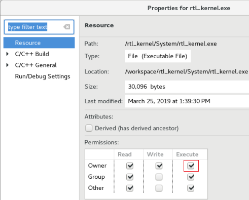
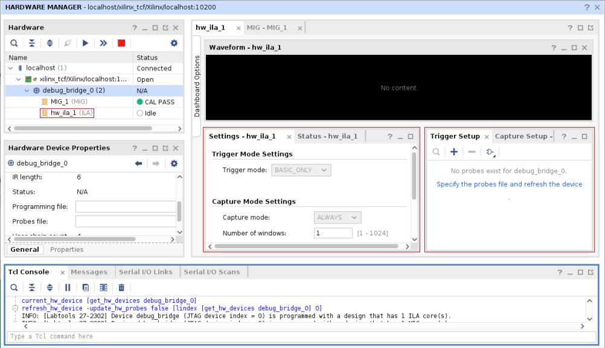
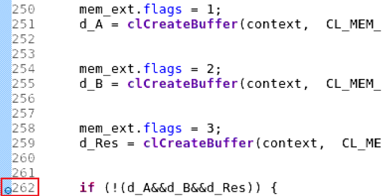
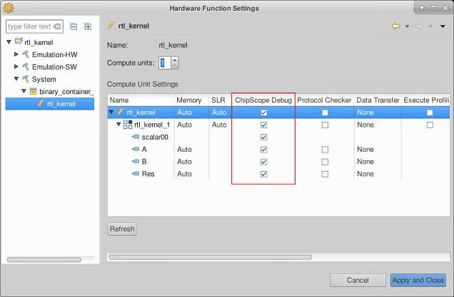

<table style="width:100%">
  <tr>
    <th width="100%" colspan=6><h2>XUP SDx Labs (2018.3)</h2></th>
  </tr>
  <tr>
    <td align="center"><a href="setup_sdx.md">1. Setup SDx</a></td>
    <td align="center"><a href="sdx_introduction.md">2. Introduction to SDx</a></td>
    <td align="center"><a href="Optimization_lab.md">3. Optimization</a></td>
    <td align="center"><a href="rtl_kernel_wizard_lab.md">4. RTL Kernel Wizard</a></td>
    <td align="center"><a href="debug_lab.md">5. Debugging</a></td>
    <td align="center"><a href="sources/helloworld_ocl/command_line.ipynb">6. SDx command line</a></td>
  </tr>
</table>

# Hardware/Software Debugging

## Introduction

This lab is a continuation of the previous (**<a href="rtl_kernel_wizard_lab.md">RTL-Kernel Wizard Lab</a>**) lab. You will use ChipScope to monitor signals at the kernel interface level and perform software debugging using SDx. Note that this lab is not currently supported on Nimbix as the Xilinx Virtual Cable (XVC is not supported)

## Objectives

After completing this lab, you will be able to:

* Add ChipScope cores to an SDx design
* Use ChipScope to monitor signals at the kernel interface
* Debug a software application in SDx

## Steps

### Open SDx and import the project

To save time on compilation, a precompiled project will be provided with the Chipscope debug cores already included in the design. 

* Open SDx
    Make sure your target platform has already been imported. You will see an error if the platform used by the precompiled project is not available.
* From the SDx *File* menu, select **Import**
* In the *Import Wizard*, expand *Xilinx* and select **SDX Project** and click **Next**
* Select **SDx project exported zip file** and click **Next**
* Browse to the appropriate *folder* for your target and click **OK** You should see a .sdx.zip file in the folder you select. 
      sdxlabs/sources/debug/<aws|u200>
* Select the appropriate project archive for your target and click **Next**

#### Set permissions on imported executable

* Once the project has been imported, in *Project Explorer* expand **debug>System**
* Right click on *debug.exe* and select **Properties**
* Tick the box to add **Execute** to the *Owner* permissions




* If you don't see an option to set the permissions, open a terminal, browse to the directory containing the debug.exe, and run the following command to change the permissions to make the file executable:

```
chmod 777 debug.exe 
```

### Hardware Debugging

#### Review Appendix-I section to understand how to add the ChipScope Debug bridge core and build the project. The debug core has been included in the precompiled sources provided

#### Run the application

* Open the project.sdx and select **System** as the Active build configuration.

* From the **Run** menu, select **Run Configurations**
* Expand *OpenCL* and select *debug-Default*
* For Alveo, in the *Arguments* tab make sure **Automatically add binary container(s) to arguments** is selected. For AWS, make sure the *.awsxclbin filename is listed as an argument
* Click **Run**

The host application will start executing, load the bitstream, and wait for user input (press any key to continue) 


### Set up the Xilinx Virtual Cable (XVC)

The Xilinx Virtual Cable (XVC) is a virtual device that gives you JTAG debug capabilities over PCIe to the target device. XVC will be used to debug the design. 

#### For Alveo U200

For an Alveo board, you need to determine the XVC device in your system. XVC is installed as part of the SDx and XRT installation. 

```
      ls /dev/xvc_pub*
```

This will report something similar to the output below:

```
      /dev/xvc_pub.u513
```

Each computer may have a different value for *xvc_pub.\** so you will need to check the name for your computer. 

* In a terminal window, start a virtual jtag connection 

Run the following command (where _u513_ should be the value your obtained from the previous command):

```
      sdx_debug_hw --xvc_pcie /dev/xvc_pub.u513 --hw_server
```

```
      launching xvc_pcie...
      xvc_pcie -d /dev/xvc_pub.u513 -s TCP::10200
      launching hw_server...
      hw_server -sTCP::3121

      ****************************
      *** Press Ctrl-C to exit ***
      ****************************
```

The Virtual JTAG XVC Server will start listening to TCP port **10200** in this case. This is the port you will need to connect to from Vivado (below). Note the *hw_server* is listening to TCP port 3121.

Skip the next section and continue with [Connecting Vivado to the XVC](#connect_vivado_to_xvc)

#### For AWS
For AWS run the following script which will manage setup of the XVC:

   ```
      sudo fpga-start-virtual-jtag -P 10200 -S 0
   ```


<a name="connect_vivado_to_xvc"></a>

### Connecting Vivado to the XVC

* Start Vivado from another terminal

   ```
      vivado
   ```

* Click on **Open Hardware Manager** link
* Click **Open Target > Autoconnect**


* Right click on *localhost (0)* and select **Add Xilinx Virtual Cable (XVC)** 

   

* Enter **localhost** as the *host name*, and **10200** as the port (or the *port number* for your machine obtained previously) and click **OK**

   

* Right click on the *debug_bridge* and select **Refresh Device**.

The Vivado Hardware Manager should open showing _Hardware_, _Waveform_, _Settings-hw_, _Trigger-Setup_ windows. The _Hardware_ window also shows the detected ILA cores (*hw_ila_\**), inserted in the design. The Alveo design will have one ILA. The AWS design will have two ILAs, one monitoring the AWS shell interface. 




* Select the *debug_bridge* in the Hardware panel
* In the _Hardware Device Properties_ view, click on the browse button beside **Probes file**
* Browse to the project's **./workspace/debug/System** folder, select the **.ltx** file and click **OK**  
* Select the *hw_ila_1* tab, and notice four (Slot_0 to Slot_3) probes are filled in the Waveform window
* Click on the **Run Trigger immediate** button  and observe the waveform window is fills with data showing that the four channels were _Inactive_ for the duration of the signal capture. 

   

* Expand **slot_1 : KVAdd_1_m01_axi : Interface** , then find and expand  **slot_1 : KVAdd_1_m01_axi : W Channel** in the Waveform window.
* Select the **WVALID** signal and drag it to the Trigger Setup - hw window

   

* Click on drop-down button of the Value field and select trigger condition value as 1

   

* Click on the _Run trigger_ button and observe the _hw_ila_1_ probe is waiting for the trigger condition to occur

   

* Switch to the SDx window select the *Console* window and press the **Enter key** to allow the program to continue executing
Observe that the program completes displaying **INFO: Test completed successfully** in the Console window
* Switch back to Vivado and notice that because the trigger condition was met, the waveform window has been populated with new captured data. 

   

* Expand **Slot_0, slot_1,** and **slot_2** groups, zoom in to the region around samples _450 to 1000_, and observe the data transfers taking place on each channels. Also note the addresses from where data are read and where the results are written to.

   

* Zoom in on one of the transactions and hover your mouse at each successive sample and notice the data content changing
* When you are finished, close Vivado by selecting **File > Exit**
* Close the jtag probe by switching to its terminal window and pressing _Ctrl-C_

### Perform Software Debugging

* Switch to the SDx GUI

* From the **Run** menu, select **Debug Configurations**

* Make sure that the **Arguments** tab shows **../binary_container_1.xclbin** 

* Click **Debug**  

* Click **Yes** when prompted to switch to the _Debug perspective_
The bitstream will be downloaded to the FPGA and the host application will start executing, halting at **main()** entry point

* In _host_example.cpp_ view scroll down to line ~262 and double-click on the left border to set a breakpoint  At this point, three buffers would have been created

  
  
* Click on the **Resume** button or press **F8** 

* When prompted click in the console and press *Enter* 
  The program will resume executing and stop when it reaches the breakpoint  
  At this point you can click on the various monitoring tabs (*Variables, Command Queue, Memory Buffers* etc.) and see the contents currently in scope
  SDx debug allows command queues and memory buffers to be examined as the program execution progresses

* Click back to select *Debug.exe > #Thread 1* in the Debug panel

* Click on the **Step Over** button or press **F6**
  

The execution will progress one statement at a time

* Continue pressing **F6** until you reach line ~326 at which point kernel will finish executing

* Select the **Memory Buffers** tab 
Notice that three buffers are allocated, their IDs, DDR memory address, and sizes

    

* Select the **Command Queue** tab and notice that there no commands enqueued. 


Lines ~326-330 creates commands to read the data and results

```
   err |= clEnqueueReadBuffer( ... );
```

* Press **F6** to execute the first `clEnqueueReadBuffer()` to create a read buffer command for reading operand _d\_A_ 
Notice the Command Queue tab shows one command submitted

    

* Press **F6** to execute the next `clEnqueueReadBuffer()` for _d\_B_ 
Notice the Command Queue tab shows two commands submitted

    

* Set a breakpoint at line ~384 (`clReleaseKernel()`) and press **F8** to resume the execution  
Notice that the Command Queue tab still shows entries
* Press **F6** to execute `clReleaseKernel()`
Notice the Memory Buffers tab is empty as all memories are released
* Click **F8** to complete the execution
* Close the SDx program

## Conclusion

In this lab, you used the ChipScope Debug bridge and cores to perform hardware debugging. You also performed software debugging using the SDx GUI.

## Appendix-I

### Steps to Add ChipScope Debug core and build the design

* In the **Assistant** tab, expand **System > binary_container_1 > KVadd**
* Select **KVAdd**, right-click and select **Settings...**
* In the **Hardware Function Settings** window, click **Refresh**, and then click on the _ChipScope Debug_ option for the _KVAdd_ kernel



* Click **Apply and close**
* In the **Project Explorer** tab, expand **src > sdx_debug > KVAdd** and double-click on the **host_example.cpp** to open it in the editor window
* Around line 240 (after the _clCreateKernel_ section) enter the following lines of code and save the file. This will pause the host software execution after creating kernel but before allocating buffer
   ```
      printf("\nPress ENTER to continue after setting up ILA trigger...");
      getc(stdin);
   ```


* Build the design

### Disable automatic rebuilding of the design

When you export a project, and re-import it, the file modified dates may change and cause SDx to make the output executable and hardware kernel "out-of-date". This may cause the design to be automatically recompiled when an attempt is made to run the application from the GUI.  

* To disable automatic rebuilding, right click on the project folder, and select **C/C++ Build Settings**

* Select **C/C++ Build** and click on the **Behavior** tab

* Uncheck the following:
   * Build on resource save (Auto Build)
   * Build (Incremental build)
   * Clean

When you export a project, and re-import it, these settings stop the bitstream being automatically rebuilt.


If you need to rebuild the project, you can re-enable these settings. If you only need to update the host application, you can run the following command in a terminal in the project folder to rebuild the .exe only (where *debug.exe* is the name of the executable): 

```
cd ./workspace/debug/System
make debug.exe
```

### References

[SDx Debug techniques](https://www.xilinx.com/html_docs/xilinx2018_3/sdaccel_doc/dtp1532068222773.html)


