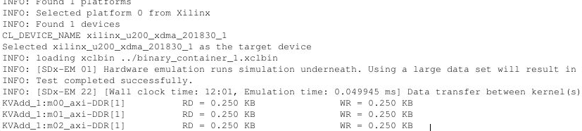
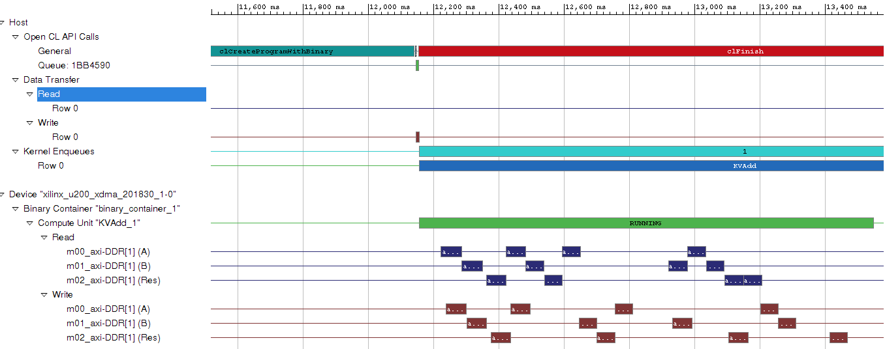

<table style="width:100%">
  <tr>
    <th width="100%" colspan=6><h2>XUP SDx Labs (2018.3)</h2></th>
  </tr>
  <tr>
    <td align="center"><a href="setup_sdx.md">1. Setup SDx</a></td>
    <td align="center"><a href="sdx_introduction.md">2. Introduction to SDx</a></td>
    <td align="center"><a href="Optimization_lab.md">3. Optimization</a></td>
    <td align="center"><a href="rtl_kernel_wizard_lab.md">4. RTL Kernel Wizard</a></td>
    <td align="center"><a href="debug_lab.md">5. Debugging</a></td>
    <td align="center"><a href="sources/helloworld_ocl/command_line.ipynb">6. SDx command line</a></td>
  </tr>
</table>

# Using the RTL Kernel Wizard

## Introduction

This lab guides you through the steps involved in using the SDx RTL Kernel wizard. This allows RTL code to be used in an SDx design.

## Objectives

After completing this lab, you will be able to:

- Understand how to use the RTL Kernel wizard available in SDx 
- Create a new RTL based IP
- Add the new IP to an application
- Verify the functionality of the design in hardware

## Steps

### Create an SDx Project

* Start SDx and select the default workspace (or continue with the workspace from the previous lab)

* Click on the **Create Application Project** link on the _Welcome_ page

* In the _New Project_&#39;s page enter **rtl\_kernel** in the _Project name:_ field and click **Next**

* Select your target platform and click **Next**

* Select **Empty Application** and click **Finish**

### Create RTL\_Kernel Project using RTL Kernel Wizard      

* Make sure the **project.sdx** under _rtl\_kernel\_example_ in the **Project Explorer** tab is selected

* Select **Xilinx &gt; RTL Kernel Wizard…**  

    

* Click **Next**

* Change _Kernel_ name to **KVAdd**, (for Kernel Vector Addition), _Kernel vendor_ to **Xilinx** leaving the _Kernel library_ and _Number of clocks_ to the default values
    

    
    

    

    <i>Setting general settings including name and number of clocks</i>
    

* Click **Next**

* Leave _Number of scalar kernel input arguments_ set to the default value of **1** and the _Argument type_ as **unit** and click **Next**
    

    
    

    

    <i>Selecting number of scalar arguments</i>
    

* We will have three arguments to the kernel (2 input and 1 output) which will be passed through Global Memory. Set _Number of AXI master interfaces_ to be **3**

* Keep the width of each AXI master data width to **64** (note this is specified in bytes so this will give a width of 512 bits for each interface), name **A** as the argument name for *m00\_axi*, **B** for *m01\_axi*, and **Res** for *m02\_axi*
    

    
    

    

    <i>Selecting number of AXI master interfaces, their widths, and naming them</i>
    

* Click **Next** and the summary page will be displayed showing a function prototype and register map for the kernel.  

  Note the control register and the scalar operand are accessed via the S\_AXI\_CONTROL interface. The control register is at offset 0x0 and the scalar operand is at offset 0x10.

* Click **OK** to close the wizard  

  Notice that a Vivado Project will be created and opened

### Analyze the design created by the RTL Kernel wizard

* Expand the hierarchy of the Design Sources in the Sources window and notice all the design sources, constraint file, and the basic testbench generated by the wizard

There is one module to handle the control signals (ap_start, ap_done, and ap_idle) and three master AXI channels to read source operands from, and write the result to DDR. The expanded m02_axi module shows *adder*, *read*, *write* instances.
* Select **Flow Navigator &gt; RTL ANALYSIS &gt; Open Elaborated Design** which will analyze the design and open a schematic view. Click **OK**
* You should see two top-level blocks: example and control as seen below

 

Notice the AXI Master interfaces are 64 bytes (or 512 bits) wide as specified earlier.

* Double-click on the example block and observe the three hierarchical Master AXI blocks

* Zoom in into the top section and see the control logic the wizard has generated the ap_start, ap_idle, and ap_done control signals

* Traverse through one of the AXI interface blocks (e.g. m02) and observe that the design consists of a Read Master, Write Master, and an Adder. (Click on the image to download an enlarged version if necessary)

* Close the elaborated view by selecting **File &gt; Close Elaborated Design**
* Click **OK**

### Generate the RTL Kernel

* Select **Flow > Generate RTL Kernel** 
* Click **OK** using the default option (Sources-only kernel)  
The packager will be run, generating the xo file which will be used in the design. 
* Click **OK**, and **Yes** to exit Vivado and return to SDx.

### Analyze the RTL kernel added to the SDx project 

* Expand the _src_ folder under the **rtl\_kernel\_example**  
Notice that the _sdx\_rtl\_kernel\_wizard_ folder  has been added to the project. Expanding this folder shows the kernel (.xo) and a C++ file have been included.

* Double-click on the **host_example.cpp** to open it.   
  * The _main_ function is defined around line 60. The number of words it transfers is 4096. 
  * Notice around line 94 the source operands and expected results are initialized. 
  * Around line 200 (from the `clCreateProgramWithBinary()` function) shows the loading of the xclbin and creating the OpenCL kernel (`clCreateKernel()`). 
  * The following lines show how the buffers are created in the device memory and enqueued (`clCreateBuffer()`, `clEnqueueWriteBuffer()`). 
  * Around lines 290, the arguments to the kernel are set (`clSetKernelArg()`), and the kernel is enqueued to be executed (`clEnqueueTask()`)).
  * Around line 320 results are read back (`clEnqueueReadBuffer()`) and compared to the expected results. 
  * The _Shutdown and cleanup section_ shows releasing of the memory, program, and kernel.

### Add the design as a hardware kernel, and build the project

* Select **project.sdx** in the _Project Explorer_ tab to see the project settings page

* Click on the **Add Hardware Function button** () and select _KVAdd_

* Select **Emulation-HW **on the drop-down button of _Active build configuration_ 

* Select **Project &gt; Build Project** or click on the () button  

  This will build the project including rtl\_kernel\_example.exe file under the Emulation-HW directory

* Select **Run &gt; Run Configurations…** to open the configurations window

* Click on the **Arguments** tab select **Automatically add binary container(s) to arguments** 

* Click **Apply**, and then click **Run** to run the application

* The Console tab shows that the test was completed successfully along with the data transfer rate

* In the **Assistant** tab, expand **Emulation-HW > rtl_kernel_example-Default**, and double-click on the **Application Timeline** entry, expand all entries in the timeline graph, zoom appropriately and observe the transactions

This example will be used as the starting point for the next lab, so it is not necessary to test the design in hardware now. 

## Conclusion

In this lab, you used the RTL Kernel wizard to create an example RTL adder application. You configured the template and saw the example code that was generated. You performed HW emulation and analyzed the application timeline. 

---------------------------------------

Start the next lab: [6. Debug Lab](debug_lab.md)
