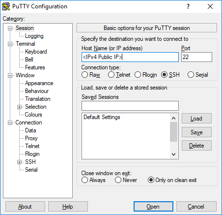
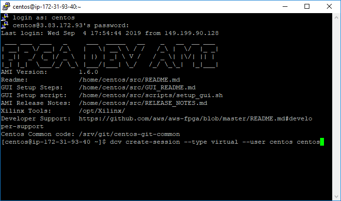
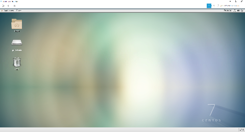

<table style="width:100%">
  <tr>
    <th width="100%" colspan=6><h2>XUP SDx Labs (2018.3)</h2></th>
  </tr>
  <tr>
    <td align="center"><a href="setup_sdx.md">1. Setup SDx</a></td>
    <td align="center"><a href="sdx_introduction.md">2. Introduction to SDx</a></td>
    <td align="center"><a href="Optimization_lab.md">3. Optimization</a></td>
    <td align="center"><a href="rtl_kernel_wizard_lab.md">4. RTL Kernel Wizard</a></td>
    <td align="center"><a href="debug_lab.md">5. Debugging</a></td>
    <td align="center"><a href="sources/helloworld_ocl/command_line.ipynb">6. SDx command line</a></td>
  </tr>
</table>

# Connecting to AWS

## Introduction

The following instructions are for attendees on a live instructor led workshop where an AWS F1 instance has been set up for you, and you have been provided with log-in details. If you are not attending a live workshop, go back to the [Setup SDx](./get_started) page and follow one of the other options to work through these labs.

This lab will guide you through the steps involved in connecting to a Xilinx workshop AWS EC2 F1 instance, and starting and stopping the instance.

## Objectives

After completing this lab, you will be able to:

- Connect to an AWS EC2 F1 instance using the provided credentials
- Start an instance
- Start a RDP (Remote Desktop Protocol) session
- Close the RDP session
- Stop the instance

## Steps
Each registered participant to Xilinx workshop has been allocated a pre-configured EC2 F1 instance and should have received an email with the following details:  

- Account ID, 
- IAM username, 
- Link to access a pre-configured EC2 F1 instance

### Login into the AWS and starting an F1 instance

* Follow the link provided by your instructor, or go to [https://console.aws.amazon.com/ec2](https://console.aws.amazon.com/ec2) to open a login page  
  If you had used the link then you should see a login page similar to shown here:

<p align="center">

</p>
<p align = "center">
<i>Login page accessed through the provided link</i>
</p>  

* Use the log in details provided by your instructor. 

* In the top right corner, using the drop-down button, select a region with F1 instances, such as **N. Virginia (US East)** or the region indicated by your instructor

<p align="center">

</p>
<p align = "center">
<i>Selecting a region</i>
</p>  
If you select the wrong region you may not see your instance.

* Click on the **EC2** link on the dashboard or if not visible, then click on the _Services_ drop-down button and then click on **EC2**

<p align="center">


</p>
<p align = "center">
<i>Accessing EC2 service</i>
</p>  

* Click on the **Instances** link on the left panel
    <p align="center">
    
    </p>
    <p align = "center">
    <i>Accessing Instances</i>
    </p>  
    You may see several instances
* Enter your username in the filter field just below the **Launch Instance** button and hit enter
    <p align="center">
    
    </p>
    <p align = "center">
    <i>Filtering your instance</i>
    </p>  
* Making sure that your instance is selected, click on the **Actions &gt; Instance State &gt; Start**
    <p align="center">
    
    </p>
    <p align = "center">
    <i>Starting an instance</i>
    </p>  
* Click on the **Yes, Start** button
* Click on the refresh button() to see the updated status to _Running_
    <p align="center">
    
    </p>
    <p align = "center">
    <i>Running state</i>
    </p>  
* Make a note of the Public DNS and IPv4 Public IP which will be used by PuTTy and Remote Desktop (RDP)
    <p align="center">
    
    </p>
    <p align = "center">
    <i>Assigned IP to the running instance</i>
    </p>  
### Interacting with the Instance using DVC

There is a bug in CentOS 7 elated to RDP. DVC as recommended by Amazon will be used to remote desktop to the instance. 

* Download and install the appropriate NICE DCV client here: https://download.nice-dcv.com

Open PuTTY, enter the IPv4 Public IP address from the Amazon console, and click open



This should open a terminal to the AWS instance. 

* In the terminal, enter the following command to start the DCV server:

```
dcv create-session --type virtual --user centos centos
```



* Stop the firewall

```
sudo systemctl disable firewalld
sudo systemctl stop firewalld
```


## NICE DCV

Open the NICE DCV application, enter the I*Pv4 Public IP* from the Amazon console and click **Open**


* When prompted, enter the username and password provided by your instructor to connect to the instance.




# Verify XRT and SDx tools

- Right-click on the desktop and select **Open Terminal** and verify the Xilinx SDx tools have been preinstalled and are on the path by executing the following command:

```
   which sdx
```

The XRT (Xilinx Run Time) tools are installed (/opt/xilinx/xrt) but are not included on the path by default. 

* Execute the following to change the permissions of the XRT setup file, and to automatically source the XRT tools. Make sure to only execute this once. 


```
   sudo chmod 774 /opt/xilinx/xrt/setup.sh
   echo "source /opt/xilinx/xrt/setup.sh" >> ~/.bashrc
```

For your reference, in the commands below, $AWS_FPGA_REPO_DIR has already been defined in the environment from: /etc/profile.d/aws-f1.sh 

* Exectue the following to clone the *aws-fpga* repository and setup the Xilinx tools. aws-fpga includes the AWS F1 tools, HDK and documentation:

```
   cd ~/src/project_data
   git clone https://github.com/aws/aws-fpga
   cd $AWS_FPGA_REPO_DIR                                         
   source sdaccel_setup.sh
   echo "export PLATFORM_REPO_PATHS=/home/centos/src/project_data/aws-fpga/SDAccel/aws_platform/xilinx_aws-vu9p-f1-04261818_dynamic_5_0" >> ~/.bashrc
    
```

For more details see:

https://github.com/aws/aws-fpga/blob/master/SDAccel/README.md

---------------------------------------

Return to [Setup SDx](./setup_sdx.md) and go to the **Getting started with the tutorials** section to finish setting up by cloning the tutorial labs. 

---------------------------------------

## Appendix: Interacting with the Instance using Putty

* Start **PuTTY** or your preferred SSH client

* Enter _centos@&lt;public\_dns\_entry&gt;_ in the **Host Name** field and **22** in the _Port_ field  
Make sure that SSH is selected as the Connection type
    <p align="center">
    
    </p>
    <p align = "center">
    <i>Session settings in PuTTY</i>
    </p>  
  
* Expand **SSH** under the _Connection_ in the left panel and click **Auth**

* Click on the **Browse…** button, browse to where the private key has been stored  
  If you don&#39;t have the private key file (as in workshop) you can skip this step

* Click **Open**
    <p align="center">
    
    </p>
    <p align = "center">
    <i>Selecting private key file</i>
    </p>  
    
* Click **Yes** 
The PuTTY window will open. It will ask for the password (in case of the workshop). Enter the provided password
  
    <p align="center">
    
    </p>
    <p align = "center">
    <i>The PuTTY window showing the connection</i>
    </p>  
  
* Set a password for the RDP connection with the following command

    ```
    sudo passwd <your choice of password> 
    ```

    You will use the same password in the RDP connection.

* Enter **exit** to close the session


### Connect using RDP (deprecated for 2018.3)

**You can communicate with the instance using command line through PuTTY or Git Bash, and using GUI through remote desktop (RDP) connection.**

- Start a remote desktop session

- Enter the _IPv4_ address

- Click on the **Show Options**

  

- Select the **Display** tab and select _True Color (24 bit)_ and click **Connect**

  

- A certificate warning will be displayed. Click **Yes** to open the RDP session

- Enter centos as the username and enter the provided password and click **OK**

  